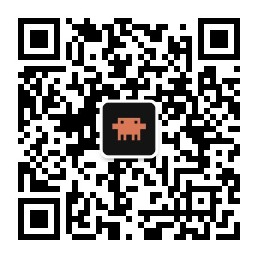

# image-text-replace

图片文字替换 Codex skill:OCR / 手工框选文字区域 → 精准 mask → inpaint 去字 → 重排目标语言文字 → 输出 QA 和对比图。

适合处理已经烧进图片像素里的文案、标签、海报字、电商图说明、截图文字、水印等。目标不是简单盖字,而是先做无字底图,再重新排版目标语言。

```
OCR / regions JSON → text mask → OpenCV inpaint clean image → Pillow redraw target text → QA
```

## 给 Codex 安装

```bash
mkdir -p ~/.codex/skills
git clone https://github.com/tangka/image-text-replace.git ~/.codex/skills/image-text-replace
```

更新:

```bash
cd ~/.codex/skills/image-text-replace
git pull
```

安装后重启 Codex 或开启新会话。之后可以直接说:

- “用 image-text-replace 把这张图里的中文去掉,换成英文。”
- “这张电商图保留 logo,只把促销文案翻译成中文。”
- “先生成 clean 图给我检查,确认没残留后再加新文字。”

## 用法

先 OCR 生成可编辑区域:

```bash
uv run --python 3.12 --with pillow scripts/image_text_replace.py inspect image.png \
  --output-dir outputs \
  --prefix demo \
  --ocr-lang eng
```

编辑 `outputs/demo.regions.json`,补全漏识别区域、replacement、keep 标记。然后跑完整替换:

```bash
uv run --python 3.12 --with pillow --with opencv-python scripts/image_text_replace.py run image.png \
  --regions outputs/demo.regions.json \
  --target-lang English \
  --output-dir outputs \
  --prefix demo \
  --mask-mode text \
  --compare
```

也可以一条命令 OCR + 去字 + 替换:

```bash
uv run --python 3.12 --with pillow --with opencv-python scripts/image_text_replace.py run image.png \
  --ocr-lang eng \
  --target-lang Chinese \
  --output-dir outputs \
  --prefix demo \
  --mask-mode text \
  --compare
```

## regions JSON

```json
{
  "source": "/absolute/path/image.png",
  "regions": [
    {
      "id": "r001",
      "text": "SALE",
      "replacement": "促销",
      "box": [120, 80, 240, 64],
      "keep": false,
      "fill": "auto",
      "stroke": "auto",
      "align": "center"
    }
  ]
}
```

- `box` 是 `[x, y, width, height]`。
- `keep: true` 表示 OCR 识别到了,但这是 logo / 包装图案 / 产品原生文字,不要删。
- `replacement` 可手工填。若设置了 `DEEPSEEK_API_KEY`,缺失 replacement 时脚本会尝试翻译。

## 产物

| 文件 | 用途 |
|-|-|
| `<prefix>.ocr.json` | OCR 识别结果。 |
| `<prefix>.regions.json` | 可人工编辑的文字区域计划。 |
| `<prefix>.mask.png` | 去字 mask。 |
| `<prefix>.clean.png` | 去掉旧文字后的无字底图。 |
| `<prefix>.replaced.png` | 最终目标语言成品。 |
| `<prefix>.compare.png` | 原图 / 成品左右对比。 |
| `<prefix>.qa.png` | original / mask / clean / final 四宫格 QA 图。 |

## QA 标准

先看 `clean.png`:

- 旧文字要消失,包括细边和阴影。
- 背景纹理不能大面积糊。
- 产品 logo、包装图案、装饰字不能误伤。
- 复杂纹理或文字压在产品边缘上时,OpenCV inpaint 不够就切 AI inpainting。

再看 `replaced.png`:

- 新文字要符合原图视觉层级。
- 默认不用灰底条/黑底条遮罩,除非用户明确要求。
- 颜色、描边、行距、对齐尽量接近原设计。

## 依赖

- `uv`
- `tesseract` 可选,用于 OCR。没有 OCR 或语言包不足时,直接手工写 regions JSON。
- `Pillow`
- `opencv-python`
- 可选 `DEEPSEEK_API_KEY`,用于翻译。

macOS:

```bash
brew install uv tesseract
```

最小自检:

```bash
python3 /Users/tangka/.codex/skills/.system/skill-creator/scripts/quick_validate.py /Users/tangka/Code/scripts/image-text-replace
python3 -m py_compile scripts/image_text_replace.py
```

## 📣 关于作者 & 支持

这套工具来自我运营的两个公众号,欢迎关注 👇

- **Codexx** —— Codex 铁粉中文社区
- **ClaudeDevs** —— Claude 中文社区

 &nbsp;&nbsp; 

如果这些工具帮到你,欢迎请我喝杯咖啡 ☕

 &nbsp;&nbsp; 
